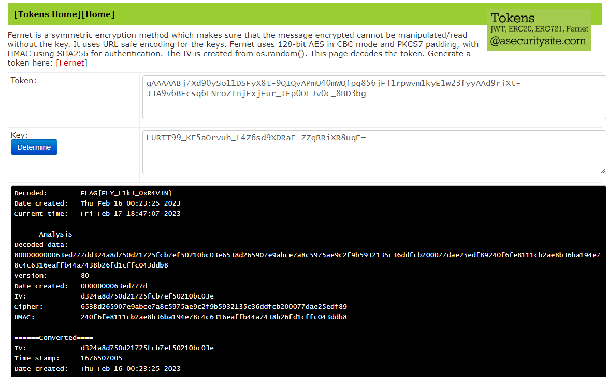

# Solution

This challenge was all about reading and understanding the python disassembly.

Given the variable key, it is base64-decoded and then each byte is XORed with 160. The result is used as as key to decipher the message. The behavior can be replicated using online tools.

## Flag: FLAG{FLY_L1k3_0xR4V3N}