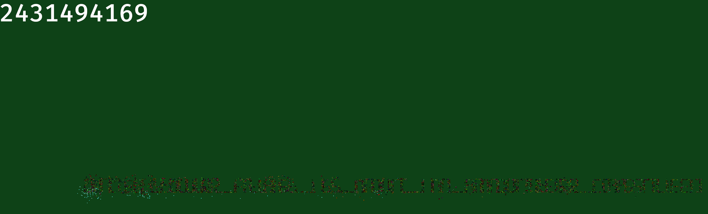

# Rev

## Dicequest
Flag: `dice{your_flag_is_not_in_another_castle}`

Solution: Use [PINCE](https://github.com/korcankaraokcu/PINCE) (just like Cheat Engine but for Linux) to discover the memory position where the money adds. To do so, do a first scan for value 0, then collect a dice and no a next scan for value 5, then repeat for value 10 and so on until you remain with just a single memory position. Modify the value of that specific memory position to something huge like 500000000. Buy every item in the game and when the invasion happens, just zoom out the map. The spawning monsters are "drawing" the flag. Example:



After a bit of contrast and saturation tweaking:


# Web

## DiceDiceGoose
Flag: `dice{pr0_duck_gam3r_AAEJCQEBCQgCAQkHAwEJBgQBCQUFAQkEBgEJAwcBCQIIAQkB}`

Solution: Modify the javascript embedded in index.html (with <script>) tags
around line 183 (the `switch` statement) such that all the cases execute the same code:
```javascript
nxt[0]--;
```
In other words, make the goose move strictly to the left with each keypress and at the same time move the player downwards (pressing s) until they meet each other. This happens in exactly 8 moves.

To modify the code it's easier to just download the index.html and modify it locally. Then execute it.
